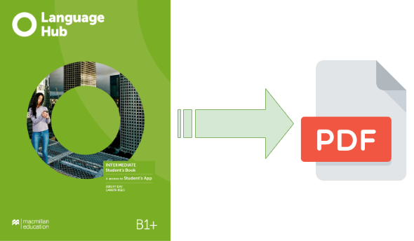

# Macmillan Education Everywhere Language Hub: Extraindo livro virtual para pdf

<!--  -->
<p align="center"></p>

Script para exportar livro virtual como pdf. Este código utiliza diversos paths *hard coded* e pode não ser totalmente replicável para outros ambientes, porém é possível facilmente adptar modificando alguns paths ([esse link pode ajudar](https://testgrid.io/blog/xpath-in-chrome-for-selenium/)).

## Comandos para executar o script

```bash
python -m venv extractor
source extractor/bin/activate
sudo sh setup.sh
python extractor.py
```